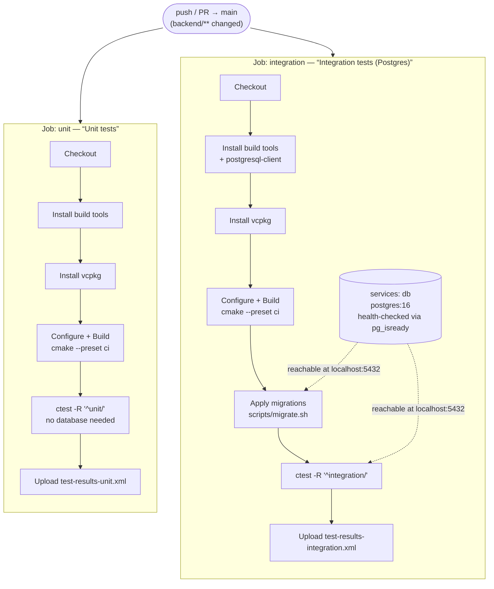
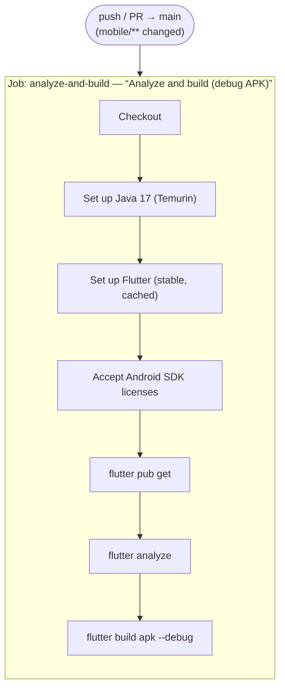

# CI pipelines

Two independent GitHub Actions workflows, one per stack. Each has a `paths:` filter so a
mobile-only commit never triggers the backend pipeline and vice versa.

> **Keep this in sync.** Whenever `backend-ci.yml` or `mobile-ci.yml` changes shape (a new
> job, a new step, a different trigger), update the matching diagram below in the same
> commit. See the `backend` / `frontend` subagent instructions, which carry this as a
> standing rule.

---

## Backend — `backend-ci.yml`

Triggers on `push`/`pull_request` to `main` when `backend/**` or the workflow file itself
changes. Two independent jobs run in parallel (no `needs:` between them — see the "Job split
rationale" comment in the workflow file for why) so a broken integration test can't hide a
real unit-test failure, and vice versa.

Both jobs build the same two Catch2 binaries (`tests_unit`, `tests_integration`); what
differs is which one's tests each job runs. `backend/tests/CMakeLists.txt` tags every CTest
name with a prefix per binary, so a single `-R` pattern selects one tier without touching the
other:

| Job | Filter | Covers |
|---|---|---|
| `unit` | `ctest -R '^unit/'` | `src/domain/` — pure logic, no I/O |
| `integration` | `ctest -R '^integration/'` | `src/repository/` — real SQL against the `services: db` sidecar |

Both jobs share the same vcpkg binary cache (`VCPKG_BINARY_SOURCES`) — building twice costs
seconds once warm, not the ~3 minute cold build. `handlers/`/`app.cpp` have no CI tier yet
(functional/E2E tests are Phase 2+, `PROJECT_PLAN.md` §8).

---

## Mobile — `mobile-ci.yml`

Triggers on `push`/`pull_request` to `main` when `mobile/**` or the workflow file itself
changes. A single job: no database, no server — just static analysis and a from-scratch
build to prove the app compiles on a clean machine.

`flutter analyze` is the fast, valuable check — type errors, null-safety violations, unused
imports, deprecated API usage, all without a device or emulator. `flutter build apk --debug`
catches what analysis can't (Gradle misconfiguration, missing manifest entries, broken native
plugin bindings) by actually compiling the app end-to-end. `flutter test` isn't run in CI
yet — `mobile/atenciosamente_app/test/widget_test.dart` is currently just a placeholder; add
a test step here once real widget tests exist.
