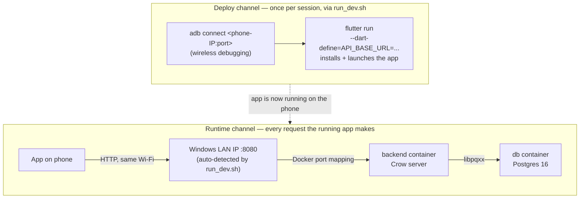

# Testing the create-notification flow on a physical device

A manual test checklist for Phase 1 (S7) on the Galaxy S20 FE, covering both the
existing feed (`GET /notifications`) and the new create flow (`POST /notifications`).
Two terminals, two distinct channels — see the diagram in step 2 if the "why two
terminals" isn't obvious.

## Before you start

- [ ] Phone and the WSL2 dev machine are on the **same Wi-Fi network**.
- [ ] Wireless debugging is on, and its **IP address & Port** are current — see the
      steps below if you're not sure.

**Finding the current IP address & Port:**

1. One-time per phone — if **Developer options** isn't in Settings yet: on the
   Galaxy S20 FE, go to Settings → **About phone** → **Software information**, then
   tap **Build number** 7 times.
2. Settings → **Developer options** → toggle **Wireless debugging** on.
3. Tap the words **"Wireless debugging"** itself, not just its toggle.
4. That opens a detail screen showing **IP address & Port** — e.g. `192.168.2.106:45481`.
5. This port changes every time the toggle goes off and back on, even though the
   phone's IP usually stays the same.
6. If it changed since your last session, copy the new value into the `PHONE_ADB=`
   line near the top of `run_dev.sh` (repo root) before running it.

**Only if `./run_dev.sh` then fails at `adb connect` with an authentication error** —
first time pairing this phone with this machine, or after a factory reset / cleared ADB
keys — do this instead of just retrying:

1. On the same Wireless debugging screen, tap **"Pair device with pairing code"**.
2. In a WSL2 terminal, run `adb pair <ip:port-from-that-screen>`.
3. Type the 6-digit code the phone shows when prompted.
- [ ] `~/projects/Atenciosamente` is the repo you're working in (not the stale Windows copy).

---

## 1. Start the backend (Terminal 1)

```bash
cd ~/projects/Atenciosamente
docker compose up -d          # starts db (healthchecked) + backend containers
docker compose exec backend bash
```

Inside the container:

```bash
scripts/dev.sh run
```

This formats, configures, builds, **applies pending migrations**, and starts the server —
one command covers all of it. Leave this terminal running; it's your server log.
You should see it start listening on `:8080`.

---

## 2. Deploy to the phone (Terminal 2)

```bash
cd ~/projects/Atenciosamente
./run_dev.sh
```

What `./run_dev.sh` does, in order:

1. Runs `adb connect` against the `PHONE_ADB` address — the IP:port you confirmed under
   **Before you start**. This is what actually reaches the phone over Wi-Fi.
2. Asks Windows (via PowerShell interop) for its LAN IP address — the one the phone can
   reach `:8080` on, since the backend container's port is published through Windows, not
   WSL2 directly.
3. Runs `flutter run`, passing that IP in as `--dart-define=API_BASE_URL=http://<ip>:8080`
   — baked into the build, not read at runtime — then installs and launches the app on
   the phone.

End result: the app on your phone talks to the backend over your LAN (step 2's IP), while
step 1's ADB connection was only ever needed to install and launch it.

**Why two separate mechanisms:** deploying the app (getting the APK onto the phone and
launched) and the app talking to the backend at runtime use two completely different
paths. Conflating them is the easy mistake here — the diagram makes the split explicit.



---

## 3. Manual test checklist

- [ ] **Feed loads** — app opens on `NotificationsScreen`, spinner then a list (or "Nenhuma
      notificação." if the table's empty). Confirms `GET /notifications` end-to-end.
- [ ] **Tap the `+` FAB** — opens the create form (`CreateNotificationScreen`).
- [ ] **Submit with an empty field** — inline red validation text appears under the field,
      nothing sent to the backend yet. Confirms local validation runs first.
- [ ] **Submit with both fields filled** — button shows a spinner, then the screen pops back
      to the feed automatically.
- [ ] **New item visible in the feed** — the notification you just created appears, without
      manually restarting the app. Confirms the refetch-after-create wiring works.
- [ ] *(optional)* **Stop the backend** (`Ctrl+C` in Terminal 1) and pull up the feed again
      (relaunch or hot-restart) — should show the "Erro ao carregar notificações." error
      state instead of hanging forever.

```mermaid
sequenceDiagram
    actor User
    participant Feed as NotificationsScreen
    participant Form as CreateNotificationScreen
    participant API as notifications_client.dart
    participant BE as Backend

    User->>Feed: tap FAB (+)
    Feed->>Form: Navigator.push(MaterialPageRoute)

    User->>Form: fill Título / Mensagem
    User->>Form: tap Criar

    Form->>Form: _formKey.currentState!.validate()
    alt empty field
        Form-->>User: inline error text, stays on form
    else fields non-empty
        Form->>Form: setState(_isSubmitting = true)
        Form->>API: createNotification(title, body)
        API->>BE: POST /notifications<br/>{title, body}

        alt title/body invalid (400)
            BE-->>API: 400 {"error": "..."}
            API-->>Form: throws Exception(error)
            Form-->>User: SnackBar with message,<br/>typed text preserved
        else created (201)
            BE-->>API: 201 {id, title, body, created_at}
            API-->>Form: AppNotification
            Form->>Feed: Navigator.pop(context, true)
            Feed->>Feed: setState():<br/>_notificationsFuture = fetchNotifications()
            Feed->>API: fetchNotifications()
            API->>BE: GET /notifications
            BE-->>API: 200 [...including the new row]
            API-->>Feed: List&lt;AppNotification&gt;
            Feed-->>User: FutureBuilder rebuilds,<br/>new card visible in feed
        end
    end
```

---

## Troubleshooting

| Symptom | Likely cause | Fix |
|---|---|---|
| `run_dev.sh` fails at `adb connect` | Wireless debugging was toggled off, so the IP:port changed | Re-open Wireless debugging on the phone, note the new IP:port, update `PHONE_ADB` in `run_dev.sh` |
| `ERROR: Could not detect Windows LAN IP` | Windows host not on Wi-Fi/Ethernet, or PowerShell interop broken | Check Windows network connection; run the `Get-NetIPAddress` line from `run_dev.sh` manually in PowerShell to debug |
| Feed spinner never resolves / "Erro ao carregar notificações." on first load | Backend not running, or phone/Windows not on the same LAN as the `db`/`backend` containers | Check Terminal 1 is still running `scripts/dev.sh run`; check `docker compose ps` |
| Create fails with a generic error immediately | Migration not applied (schema missing) | `scripts/dev.sh run` runs `scripts/migrate.sh` automatically — if you started the server a different way, run `scripts/migrate.sh` manually inside the container |
| App installs but shows a blank/crashed screen | Stale build artifact | `flutter clean` in `mobile/atenciosamente_app/`, then re-run `./run_dev.sh` |

---

## After testing

Nothing to clean up — no `TRUNCATE`/reset step exists yet, and there isn't one planned;
whatever you create during testing just becomes real feed data, which is fine at this stage
of the project.
