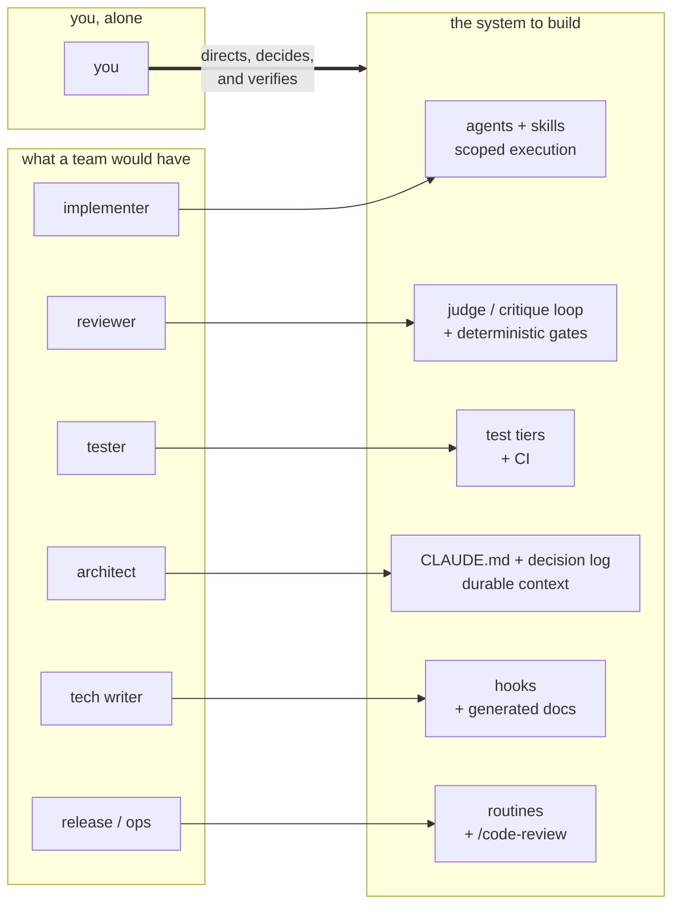
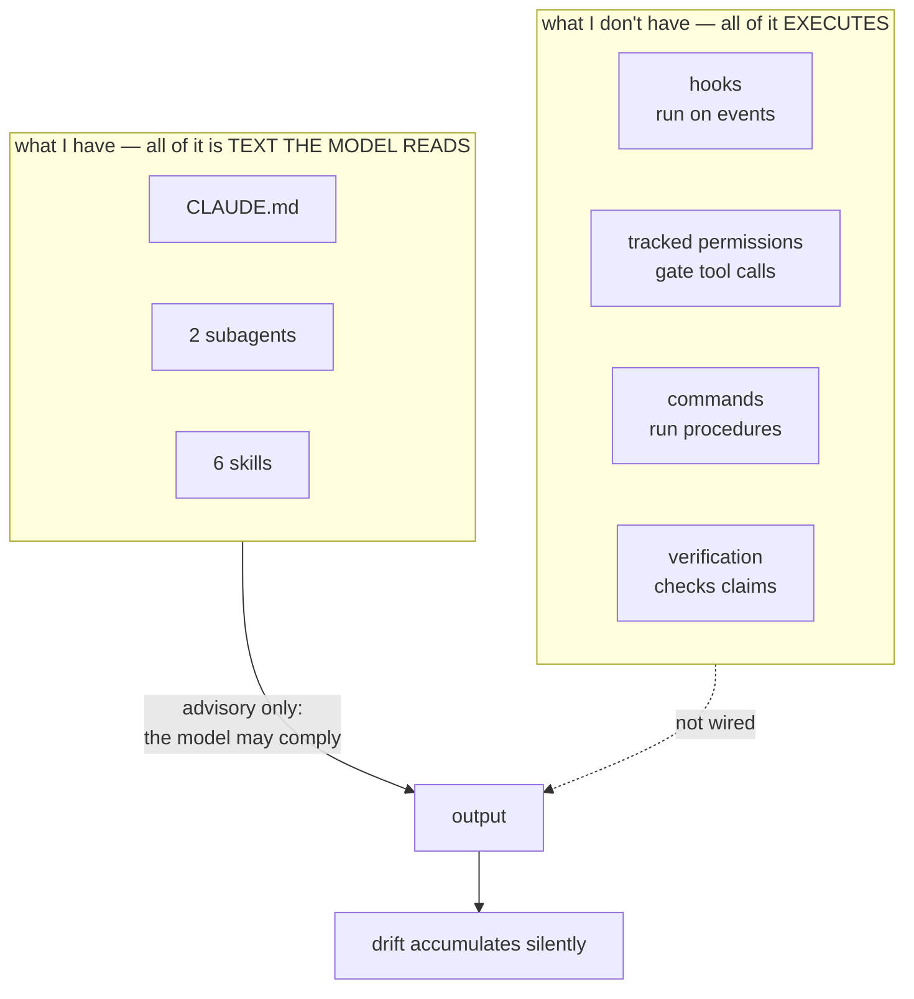
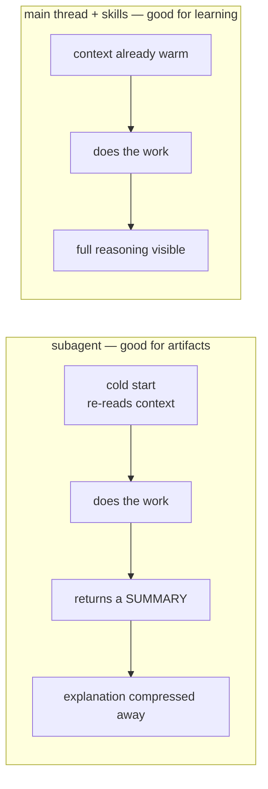
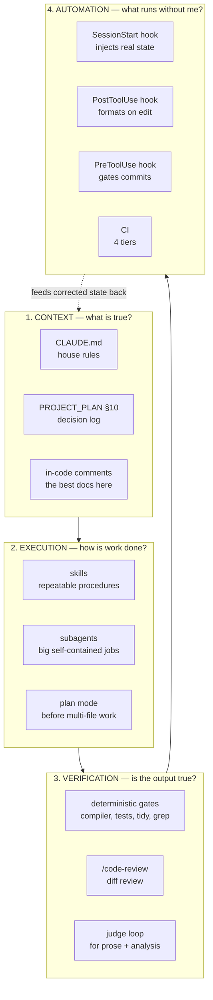
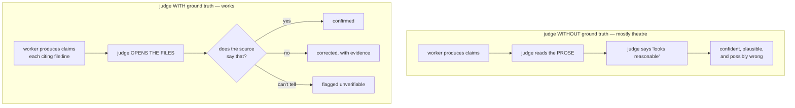
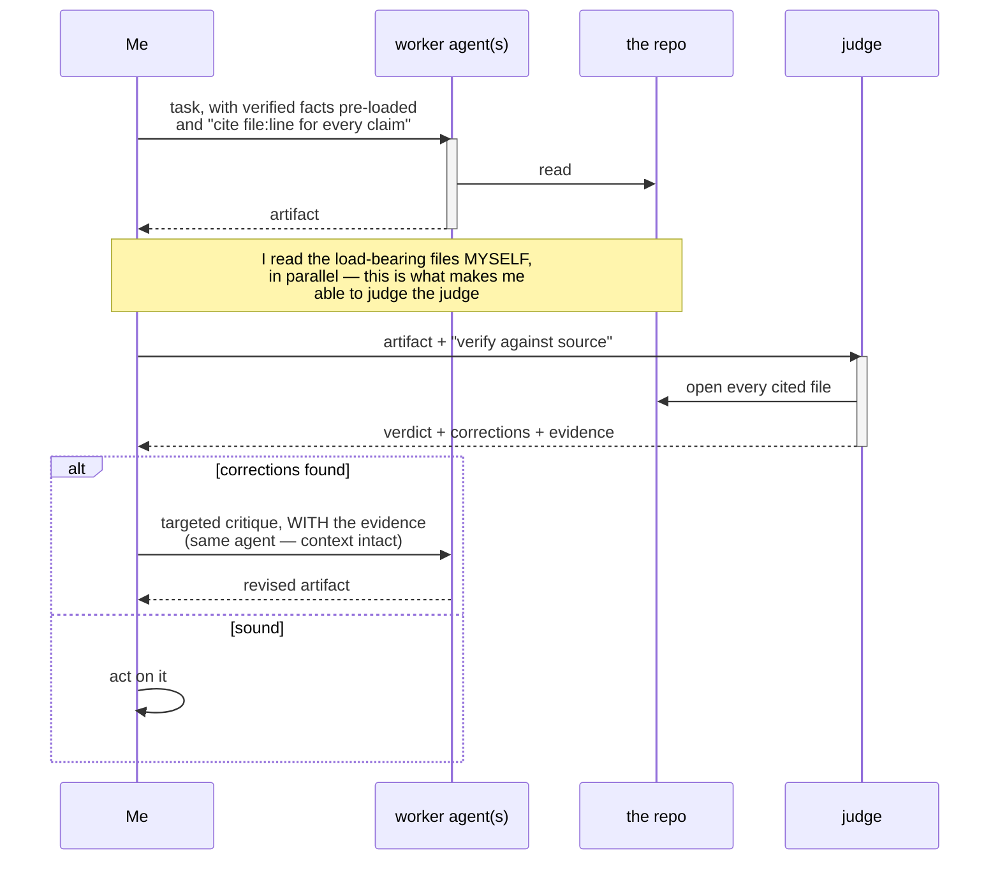
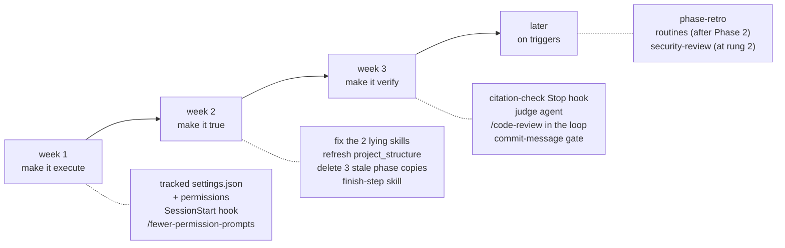

# Army of One — an AI engineering system for Atenciosamente

> How I currently use Claude on this project, what the alternatives are, and what I should
> build to operate as a one-person team shipping a C++20 backend *and* a Flutter app.
>
> **Date:** 2026-09-19 · **Companions:** [`PROJECT_ANALYSIS.md`](PROJECT_ANALYSIS.md) (what
> exists) · [`ACTION_PLAN.md`](ACTION_PLAN.md) (what to build next)

---

## 1. The goal, stated precisely

Not "use AI to code faster." The goal is: **one person covering the roles a small team would
normally split**, on two languages, without the quality collapse that usually follows.

A four-person team shipping this product would hold these roles. Solo, every one of them is
still required — they just have nobody assigned:

**The role you keep is the one that cannot be delegated: deciding what is true.** Everything in
this document is in service of making that role cheap enough that one person can sustain it.

The failure mode to avoid is equally precise. A solo developer with an LLM does not usually fail
by writing bad code — the code is typically fine. They fail by **accumulating unverified claims**:
a doc that says something the code doesn't, a test that passes for the wrong reason, a skill that
teaches a rejected approach. Each is individually small. Together they make the repo untrustworthy,
and an untrustworthy repo makes the *next* AI session worse, because the model reads it as fact.

This repo already has measured instances of all three. That is not a criticism of the work — it is
the predictable output of a system with **no verification layer**, which is exactly what §2 shows.

---

## 2. Where I am today

Nine files, four mechanisms, and a single quiet structural fact.

| Mechanism | Status | Detail |
|---|:---:|---|
| `CLAUDE.md` | ✅ | 76 lines, project-scoped. Genuinely good — the WSL/Windows warning prevents a real, expensive failure. |
| Subagents | ✅ | `backend`, `frontend` |
| Skills | ✅ | 6 project skills |
| Permissions | ⚠️ | 2 entries, in an **untracked** `settings.local.json` |
| `~/.claude/settings.json` | ⚠️ | literally `{"model": "opus"}` |
| Hooks | ❌ | none anywhere |
| Slash commands | ❌ | `.claude/commands/` does not exist |
| Output styles | ❌ | none |
| MCP servers | ❌ | no `.mcp.json` |
| Personal-scope skills / agents / commands | ❌ | `~/.claude/{skills,agents,commands}` all empty |
| Tracked project `settings.json` | ❌ | none |
| Plan mode | ❌ | no evidence of use |

### The structural fact

**Everything I use is documentation. Nothing I use executes, verifies, or gates.** The whole
setup depends on the model choosing to comply, and there is no mechanism anywhere that notices
when it doesn't.

That single fact explains every problem found in the audit:

| Drift found | Why nothing caught it |
|---|---|
| `backend/include/atenciosamente/` cited in 2 skills — **a directory that has never existed** | No check that a skill's paths resolve |
| `backend-add-migration` teaches `psql <`, the mechanism explicitly rejected in §10 | No check that a skill matches current practice |
| Phase status duplicated in 4 files, 3 stale | No single source; nothing reconciles them |
| `migrate.sh:6-8` claims CI sets `DATABASE_URL`; nothing does | No check that a comment matches reality |
| Handler layer has zero tests, by construction | Nothing measures coverage by layer |
| `.clang-tidy` committed, invoked by nothing | No check that configs are wired |

Six findings, one root cause. **Adding more documentation would not have prevented any of them.**

---

## 3. The mechanisms, ranked by payoff

Verdicts are for *this* project — solo, learning-focused, two languages, one repo.

| # | Mechanism | Verdict | Why |
|:--:|---|:---:|---|
| 1 | **Hooks** | **Adopt now** | The only mechanism that *executes*. Converts house rules from hopes into gates. Highest payoff by a wide margin. |
| 2 | **Tracked `settings.json` + permissions** | **Adopt now** | Two allow-entries for a cmake/ctest project means constant prompting. Also the home for hooks. |
| 3 | **`/code-review`** | **Adopt now** | Already available, zero setup, and it is the reviewer role you don't have. |
| 4 | **Skills (fix the 6 I have)** | **Adopt now** | Two actively teach falsehoods. Fixing beats adding. |
| 5 | **A verification/judge loop** | **Adopt now** (§5) | The reviewer role for *analysis* work, where tests can't help. |
| 6 | **Slash commands via skills** | **Adopt now** | `/finish-step`, `/phase-retro`. Rituals I currently perform by memory and frequently skip. |
| 7 | **Plan mode** | **Adopt now** | Free. Right for anything touching >2 files. |
| 8 | **Subagents (restructure)** | **Keep, demote** | Real value as routing-rule homes; wrong as the *default* — see the compression problem below. |
| 9 | **`/security-review`** | **Adopt later** | Trigger: first public IP (deploy rung 2). |
| 10 | **Routines (scheduled agents)** | **Adopt later** | Trigger: CI that runs without me watching, i.e. after Phase 2. |
| 11 | **MCP servers** | **Mostly no** | For this project, `gh` + a Bash allowlist gets ~90% at zero setup. |
| 12 | **Output styles** | **No** | `CLAUDE.md` already says "explain trade-offs". Adding a second place to say it is the drift pattern again. |
| 13 | **Agent SDK** | **No** | Builds *products* with agents. I'm building an app, not an agent platform. |
| 14 | **Multi-model judging** | **No** | Cost and complexity for a benefit I cannot measure at this scale. |

### On the three I'd skip, and why that matters

**MCP** is the one most likely to feel like progress while adding nothing. It earns its keep when
a tool is frequently updated, needs OAuth, or exposes a complex API. `gh pr view` behind a Bash
allowlist is none of those. **Setup cost is real and the alternative is one line of config.**

**Output styles** would put "explain trade-offs in depth" in a second location. `CLAUDE.md:15-16`
already says it. Every problem in §2 came from the same fact living in two places.

**The Agent SDK** is for embedding the agent loop in your own software. Reaching for it here is
the clearest available symptom of the tooling trap (§7).

### The subagent compression problem

This is the least obvious finding and it changes how I should work day to day.

A subagent runs in an isolated context and **returns a summary**. But `CLAUDE.md:15-16` states the
deliverable of this project is educational depth — *"explain trade-offs, don't just produce code."*
A summary compresses exactly that. Every S1–S7 prompt in `PHASE_1_PERSISTENCE.md` opens with *"Use
the backend subagent"*, which means **Phase 1's explanations were systematically routed through a
compressor.**

There's a second cost: a subagent starts cold, so a 20-line handler change pays a fresh read of
`project_structure.md` (256 lines) plus `PROJECT_PLAN.md` (321 lines) before writing anything.

**Rule: main thread + `Skill` invocations is the default.** Delegate to a subagent only when the
work is large, self-contained, and **the artifact matters more than the explanation** — a CI
workflow rewrite, a mechanical multi-file refactor, a dependency sweep, or parallel research like
the audits that produced these documents.

---

## 4. The architecture to build

Four layers. Each one answers a different question, and the current setup only has the first.

The feedback edge is the important one. Today my context layer degrades because nothing writes
back into it. A `SessionStart` hook that injects real `git log` and the true tail of the decision
log **closes that loop mechanically**, which is why it's the highest-payoff single change
available.

---

## 5. The judge agent — implementable spec

The centrepiece, and the thing I most want from this workflow. Specified concretely enough to build.

### 5.1 The distinction that decides whether this is worth anything

**A judge that only reads the other model's output is a second opinion, not a check.** Two models
agreeing is weak evidence — they share failure modes. The value comes entirely from the judge
having *tool access to the source* and actually opening it.

This is not theoretical. Producing the two companion documents ran **8 agents across 2 rounds**,
and the critique pass caught **7 factual errors** that a single-pass run would have shipped:

| Error | Type |
|---|---|
| A definition-of-done instructing edits to `kSelectAll` — **a constant that doesn't exist** | Fabricated identifier |
| A reported `find` precedence bug in a working snippet | False positive |
| `handle_header()` described as private; it's public | Wrong detail, right conclusion |
| `CROW_ROUTE` "requires a string literal" — real constraint is an array with deducible bound | Plausible but wrong |
| "`project_structure.md` never mentions `.claude/`" — it does, once | Overclaim |
| "Crow has no port getter" — it does, which **improved** the recommendation | Missed capability |
| "CI sets `DATABASE_URL`" — nothing does | Trusted a stale comment |

Every one was caught by opening the file. **None** would have been caught by a judge reading only
the agent's prose — several were *more* plausible than the truth.

### 5.2 Deterministic judges first — this is the money-saver

Before reaching for an LLM judge, note that **most verification is mechanical and therefore free,
instant, and incapable of hallucinating.**

| Check | Mechanism | Beats an LLM judge because |
|---|---|---|
| Does the code compile? | `cmake --build` | Definitive |
| Do tests pass? | `ctest` | Definitive |
| Memory / UB bugs | ASan, UBSan, TSan | Finds what no reviewer sees |
| Lint violations | `clang-tidy` | Deterministic, no opinion |
| Formatting | `clang-format --dry-run` | Deterministic |
| **Does every cited path exist?** | `grep -oE '[a-z_/]+\.(cpp\|hpp)' \| xargs ls` | **Catches the fabricated-citation class outright** |
| Is the commit message legal? | `PreToolUse` hook regex | Structural |

**Rule: an LLM judge is only for claims a script cannot check.** Reasoning quality, whether a
recommendation fits the project, whether a trade-off was argued honestly, whether a test asserts
what its name says. Everything else gets a gate.

That single rule is what keeps this affordable.

### 5.3 The spec

**Create `.claude/agents/judge.md`:**

- `name: judge`
- `description:` — *"Verifies a claim-bearing artifact (analysis, plan, review, design doc)
  against the actual source. Use when output will drive a decision and its claims cite files,
  line numbers, or behaviour. Not for code changes — tests judge those."*
- `tools: Read, Grep, Glob, Bash` — **read-only by construction.** A judge that can edit will fix
  things instead of reporting them, and you lose the finding.
- `model: inherit`

**The judge's contract, stated in its body:**

1. **Verify, don't redo.** Do not rewrite the artifact or produce your own better version. Your
   output is a verdict plus corrections.
2. **Sample the load-bearing claims**, not all of them. A claim is load-bearing if a
   recommendation depends on it. Budget ~10 verifications over a long document.
3. **Open the file for every claim you check.** Never judge a citation by whether it sounds right.
4. **Classify each as** `CONFIRMED` / `WRONG` (with what the source actually says) /
   `UNVERIFIABLE` (and why).
5. **Check for the specific failure modes LLMs have**, explicitly:
   - identifiers, files, or line numbers that don't exist
   - a conclusion that's right supported by a reason that's wrong
   - confident claims about a library's API without having read its header
   - a recommendation that contradicts a decision already recorded in `PROJECT_PLAN.md` §10
   - agreement with the prompt's framing where the framing was wrong
6. **Report what you could not check.** An honest "I verified 8 of ~40 claims" beats an implied
   full audit.
7. **Do not comment on style, tone, or structure** unless it changes what a reader would do.

**Output format:** a verdict line (`SOUND` / `SOUND WITH CORRECTIONS` / `DO NOT ACT ON THIS`),
then a table of `Claim | Status | Evidence | Correction`, then `## What I could not verify`.

### 5.4 The loop

**Three details that make this work, learned the hard way:**

- **Pre-load verified facts into the worker's prompt.** A cold agent burns half its budget
  re-deriving what you already know, and re-derivation is where fabrication enters.
- **Send critique back to the *same* agent, not a new one.** Its context is intact, so the
  revision is cheap and it doesn't re-litigate settled ground. In this session that also produced
  something better than correction: given evidence, agents found *their own* errors — one
  discovered its 404/405 citations pointed at Crow's websocket path rather than the live request
  path, and the corrected mechanism made its recommendation cheaper.
- **Read the load-bearing files yourself, while the agents run.** Otherwise you are trusting the
  judge with no way to judge it. This is the part that cannot be delegated.

### 5.5 When NOT to use it

Honest limits — the judge roughly **doubles token cost** for a task.

| Situation | Use a judge? |
|---|---|
| A five-line fix with a test | **No.** The test is the judge. |
| Anything the compiler or sanitizers will catch | **No.** Deterministic gate. |
| A refactor with functional tests covering it | **No.** |
| An analysis or plan that will drive a decision | **Yes.** |
| Claims about a library's API I haven't read | **Yes** — highest hit rate. |
| A phase closeout / "are we done?" question | **Yes.** |
| Work by several agents that must be consistent | **Yes.** |
| A doc I'll read carefully myself anyway | **No.** I'm the judge. |

### 5.6 The cheapest judge of all

A `Stop` hook running a script that extracts every `path:line` from the session's output and
checks the files exist. Catches the single highest-frequency failure — **fabricated citations** —
for zero tokens, on every response. Build this before the LLM judge.

---

## 6. Workflows by task type

| Task | Recipe |
|---|---|
| **Backend feature** | Main thread + `backend-add-endpoint` / `backend-add-test`. Plan mode first if >2 files. Deterministic gates do the verifying. No judge. |
| **Flutter screen** | Main thread + `frontend-add-*`. I'm new to Flutter, so the explanation *is* the deliverable — do **not** send this to a subagent. |
| **Bug** | Reproduce with a failing test first. The test is the judge. |
| **Migration** | `backend-add-migration` (after fixing it) → `dev.sh migrate` → integration test. |
| **Phase closeout** | `/phase-retro` → judge pass on the result → `finish-step`. |
| **Pre-commit** | `/code-review` on the diff. Free reviewer. |
| **Architecture decision** | Plan mode → write it up → **judge pass** → §10 row. |
| **Research / audit** | Parallel subagents → judge → targeted critique → synthesis. Exactly how this document was produced. |

---

## 7. The honest risks

**1. The tooling trap — the big one.** "My AI workflow is my side project" has an obvious failure
mode: building the workflow *instead of* the app. Tool-building feels productive, has fast
feedback, and never fails in public. Shipping a C++ backend does not.

> **The guard: no more than one tooling task per feature task.** If `ACTION_PLAN.md`'s Track D
> grows faster than Tracks A/B/C shrink, I am procrastinating with extra steps.

**2. Verification theatre.** A judge that reads prose and says "looks good" is worse than no
judge, because it manufactures confidence. Mitigation: read-only tool access is mandatory, and
the judge must report its verification *count*.

**3. Context rot.** Every mechanism added is more the model reads. §10 is already 56% of the
document attached to every conversation. Prune as I add.

**4. Skills that don't fire.** `frontend-add-model` demonstrably failed to trigger — the phase doc
had to name it explicitly. An unfiring skill is pure cost.

**5. Cost.** Parallel agents plus a judge is genuinely more expensive. The deterministic-first
rule (§5.2) is the main control.

**6. Learning displacement.** The stated goal is learning modern C++. An agent that produces
correct code I don't understand is a *failure* here, even though it would be a success on a
delivery project. This is why the subagent-summary problem matters more for me than it would for
most people.

---

## 8. Adoption sequence

Everything below maps to cards already specified in [`ACTION_PLAN.md`](ACTION_PLAN.md).

**Week 1 — make it execute.** Track a `settings.json`; run `/fewer-permission-prompts` to
generate the allowlist empirically rather than guessing; add the `SessionStart` hook that injects
real `git log` + the §10 tail. *This is the one that closes the context-rot loop.*

**Week 2 — make it true.** Fix `backend-add-migration` and `backend-add-endpoint` (phantom paths,
rejected mechanisms). Refresh `project_structure.md`. Delete three of the four phase-status copies.
Extract `finish-step` so the back-port ritual stops depending on memory.

**Week 3 — make it verify.** The citation-check `Stop` hook first (zero tokens, highest
frequency). Then `.claude/agents/judge.md`. Then `/code-review` as a standing pre-commit step.

**Later, on triggers.** `/phase-retro` once there's a phase to close. Routines once CI runs
unwatched. `/security-review` at deploy rung 2.

---

## Appendix — provenance

**Verified directly** for this document: the full `.claude/` inventory; `~/.claude/settings.json`
containing only `{"model": "opus"}`; `~/.claude/{skills,agents,commands}` all empty; absence of
`.claude/commands`, `.claude/hooks`, `.claude/output-styles`, `.mcp.json`; the 6 project skills and
2 subagents. The session-evidence table in §5.1 is first-hand — those 8 agent runs and 7
corrections happened while producing the companion documents, and each correction was verified
against source before being applied.

**Confirmed available in this installation** (these are loaded in my session right now, not
inferred from docs): `/code-review` (including `ultra`), `/security-review`, `/simplify`,
`/fewer-permission-prompts`, `/loop`, `/schedule`, `/update-config`, `/keybindings-help`,
`/claude-api`, `/run`, `/init`.

**Documented but not verified here** — check before relying on: the exact permission-rule syntax
(`Bash(cmd:*)` vs `Bash(cmd *)` — both appear valid, and if the wrong form is used **the allowlist
silently does nothing**); the full hook event list and whether `$CLAUDE_PROJECT_DIR` is exported in
every hook context; subagent frontmatter fields beyond `name`/`description`/`tools`/`model`;
routine availability and quotas on this plan. The `/hooks` and `/permissions` commands are the
authoritative check for the first two — use a trivial `echo` hook to confirm plumbing before
trusting a hook that can block.

**Not verified at all:** `claude` is not on `PATH` in this shell (running via the VS Code
extension), so no CLI capability was probed directly. Effort and payoff rankings are judgement
calls, not measurements.
