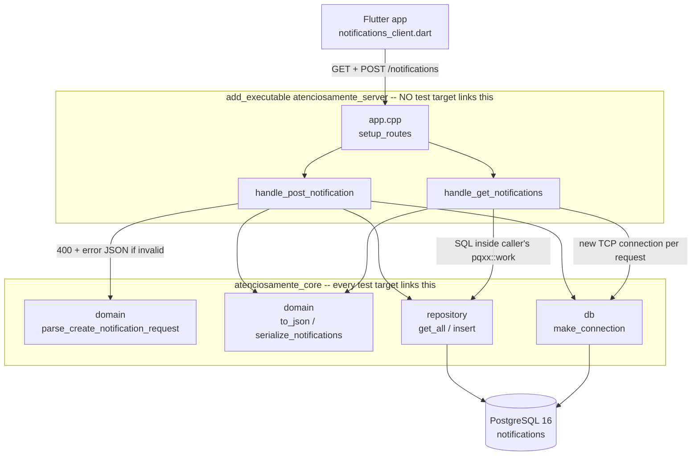
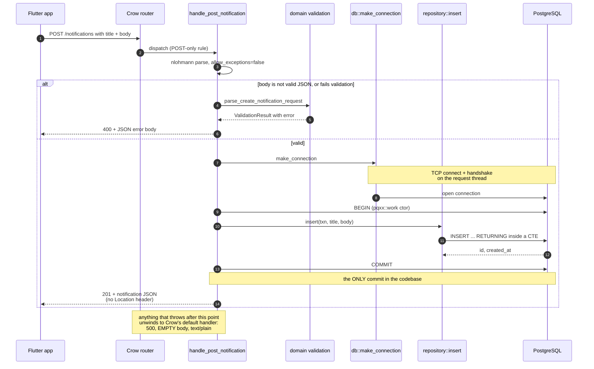
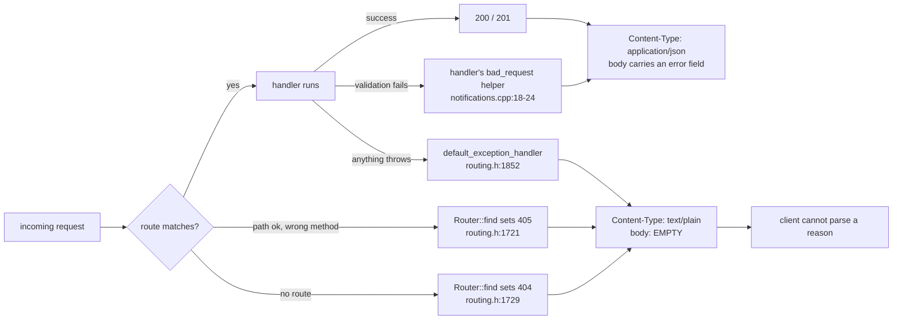
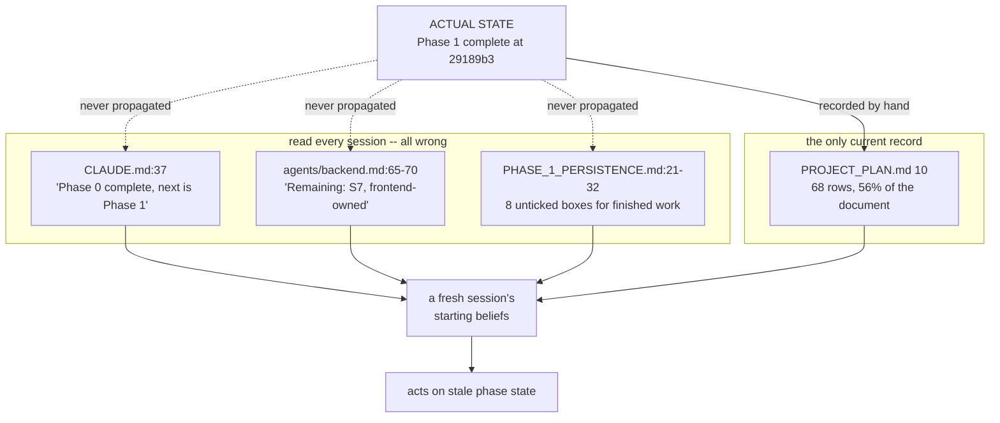
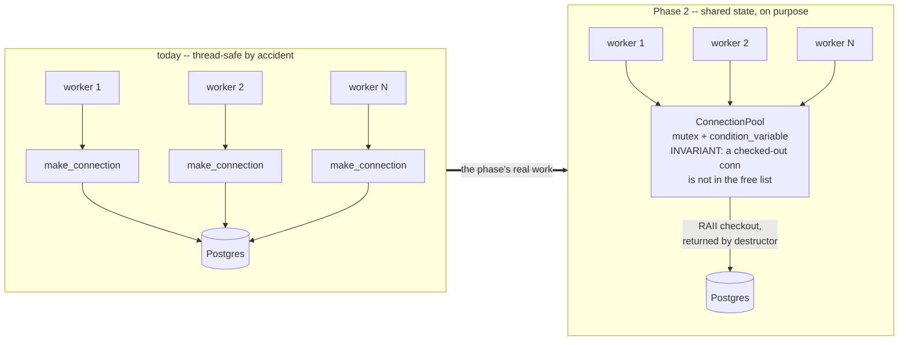
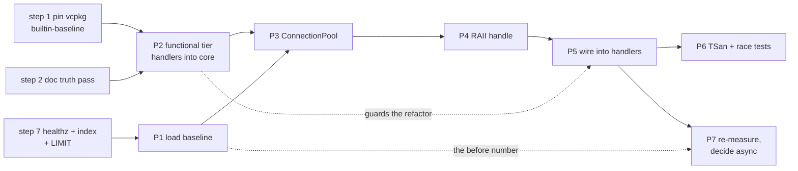

# Atenciosamente — Project Analysis

> A full review of what exists, how the backend API compares to production practice,
> how the AI workflow is performing, and what to do next.
>
> **Date:** 2026-09-18 · **Commit reviewed:** `29189b3` · **Method:** four parallel audit
> agents, each critiqued and revised, with every load-bearing claim independently verified
> against the source by the coordinator.
>
> **Read this first:** every gap below is labelled **deliberate** (a reasoned deferral you
> already recorded) or **oversight** (nobody decided this). That distinction is the point of
> the document. A learning project is *supposed* to defer things; the question is only
> whether you chose to.

---

## Executive summary — the five things that matter

**1. Phase 2 is mis-framed in your own plan, and this is the highest-value correction here.**
[`main.cpp:6`](backend/src/main.cpp#L6) already calls `.multithreaded()`. The server has been
concurrent since Phase 0, and because every request opens its own connection there is **no
shared mutable state anywhere** — the backend is thread-safe *by accident, not by design*.
That fact appears in **zero** documents (verified: grep across `Documentation/`, `.claude/`,
`CLAUDE.md` returns nothing). Phase 2 as written — "handle concurrent requests" — is a
solution hunting for a problem. Reframe it as: **measure what connection-per-request costs,
deliberately introduce shared state (a pool), then learn to make that state safe.** Do this
before writing any Phase 2 code.

**2. The HTTP layer is structurally untestable, and it blocks everything in Phase 2.**
`app.cpp` and `handlers/notifications.cpp` compile only into the server executable, never into
`atenciosamente_core` ([`CMakeLists.txt:54-58`](backend/CMakeLists.txt#L54-L58)). No test target
links them. Status codes, the `Content-Type` header, the `{"error": ...}` body, the
routing — **zero coverage**. Your own decision log (2026-04-25) justifies the `main.cpp`/`app.cpp`
split as "app.cpp can link into a test target"; it never has. This is ~4 lines of CMake and it
unlocks an entire test tier `PROJECT_PLAN.md` §8 has promised since Phase 0. It must land
*before* the pool refactor, because nothing currently guards the request path.

**3. Your dependencies are not pinned, and your decision log says they are.**
[`vcpkg.json`](backend/vcpkg.json) contains four bare dependency names and **no
`builtin-baseline`** (verified: `grep -c` returns 0). `PROJECT_PLAN.md:268` and `:272` both
assert the authoritative pin lives in that field. Meanwhile both CI jobs clone vcpkg at HEAD
with `--depth 1` ([`backend-ci.yml:112`](.github/workflows/backend-ci.yml#L112), `:226`). Your
laptop resolved Crow 1.3.3 / libpqxx 8.0.2 / nlohmann-json 3.12.0 / Catch2 3.15.2; CI resolves
independently and that set is recorded nowhere. **An upstream vcpkg change can break CI on a
commit that touched no C++** — exactly the breakage your 2026-07-27 `exec_params` entry already
documents happening once. Three lines to fix.

**4. One integration test passes for the wrong reason.**
[`notification_repository_test.cpp:72-93`](backend/tests/integration/notification_repository_test.cpp#L72-L93)
is named "get_all() orders rows most-recent-first" but inserts both rows inside a single
`pqxx::work`. Postgres's `now()` is `transaction_timestamp()` — fixed for the whole
transaction — so both rows get an **identical** `created_at`, and the assertion is satisfied
entirely by the `id DESC` tiebreak. The behaviour the test is named for is never exercised.
A test that passes for the wrong reason is worse than no test, because it buys false confidence.

**5. Your best documentation is inside your code, and your standalone docs have rotted.**
The backend is ~50% comment by line (verified: 85/167 in `notification_repository.cpp`, 40/83
in `connection.cpp`, 58/120 in `handlers/notifications.cpp`) and those comments are precise,
current and load-bearing. Meanwhile `README.md:18` still says "Phase 0 — Not yet usable",
`CLAUDE.md:37` says Phase 1 is next, `project_structure.md:36` documents a `backend/Dockerfile`
that **does not exist**, and §10 asserts a vcpkg pin that isn't there. The pattern is
consistent: **prose next to code stays true; prose in a separate file rots.** Lean into it.

---

## Scorecard

| Area | Grade | Verdict |
|---|:---:|---|
| **Backend architecture / layering** | **A−** | Genuinely enforced four-layer split. `atenciosamente_core` doesn't link Crow *and compiles* — that's a real boundary, not a naming convention. |
| **RAII & ownership** | **A** | The strongest code in the repo. Correct destruction ordering, guaranteed elision used knowingly, no leaks. |
| **SQL safety** | **A** | Fully parameterized. Only a `constexpr` is ever concatenated. Clean. |
| **API surface vs production REST** | **C** | Correct resource design and deterministic sorting; missing versioning, body limits, content negotiation, consistent error envelope, health probes. |
| **Testing** | **C+** | Excellent where it exists (rollback isolation is textbook). But the whole HTTP layer is untestable by construction, one test is defective, mobile coverage is zero. |
| **CI** | **B** | Well-reasoned job split, service containers, binary caching. No lint job, no sanitizers, no `flutter test`, unpinned actions. |
| **Build & dependencies** | **C+** | Modern target-based CMake with `-Werror` from day one — then undermined by unpinned deps and a `.clang-tidy` nothing runs. |
| **Documentation** | **B−** | In-code: A. Standalone: drifted, duplicated, and partially false. |
| **AI workflow** | **B+** | Better than most professional repos. Real skills, enforced commit convention, decision log that captures *why*. Held back by stale state in four places and no automation. |
| **Mobile** | **A−** | For its stated scope — deliberately minimal, no premature state management, every addition reasoned. Only the placeholder test drags it. |

---

## §1 — What exists today

### Backend source (14 files, 633 lines)

Four directories, each a genuine layer, dependencies pointing strictly downward:

| Layer | Files | Responsibility |
|---|---|---|
| `domain/` | `notification.hpp`, `notification_json.{hpp,cpp}`, `create_notification_request.{hpp,cpp}` | Pure data, validation, serialization. **Zero Crow, zero pqxx.** |
| `db/` | `connection.{hpp,cpp}` | `make_connection()` — reads 5 `POSTGRES_*` vars, fails loud on missing, escapes conninfo values, returns an open RAII connection. |
| `repository/` | `notification_repository.{hpp,cpp}` | `get_all(pqxx::work&)` and `insert(pqxx::work&, title, body)` — free functions taking a caller-owned transaction. |
| `handlers/` | `notifications.{hpp,cpp}` | The only file that knows both Crow and pqxx. |
| top level | `app.{hpp,cpp}`, `main.cpp` | Route registration; 7-line entry point. |

**Three endpoints:** `GET /` → `"hello"` (text/plain), `GET /notifications`, `POST /notifications`.
No classes anywhere — free functions over plain structs throughout, per `PROJECT_PLAN.md` §4.3.

The layer split is real and provable. But it is **not** the same line as the CMake target
boundary, and that difference is the most consequential fact in the codebase:



Everything inside `atenciosamente_core` has tests. Everything inside the executable box has
**none** — and cannot, until those two files move. `domain/` includes neither Crow nor pqxx,
which is why `atenciosamente_core` links no Crow at all and still compiles.

### Data layer

One migration, one table:

```sql
CREATE TABLE IF NOT EXISTS notifications (
    id          BIGINT GENERATED ALWAYS AS IDENTITY PRIMARY KEY,
    title       TEXT        NOT NULL,
    body        TEXT        NOT NULL,
    created_at  TIMESTAMPTZ NOT NULL DEFAULT now()
);
```

`scripts/migrate.sh` is an idempotent runner tracking applied files in a `schema_migrations`
table, invoked by `dev.sh run`/`test` and by CI. No secondary indexes, no CHECK constraints,
no length caps.

### Tests

| Tier | Target | Cases | Covers |
|---|---|---|---|
| Unit | `tests_unit` | 2 `TEST_CASE`, 14 `SECTION` | `notification_json.cpp`, `create_notification_request.cpp` |
| Integration | `tests_integration` | 4 `TEST_CASE` | `notification_repository.cpp`, `connection.cpp` (indirectly) |
| Functional | — | **none** | — |

**Isolation mechanism:** each integration case opens its own `pqxx::work` and never commits;
`~pqxx::work` issues `ROLLBACK`. No fixtures, no teardown, no state leaks. This is genuinely
well done.

**Untouched by any test:** `handlers/notifications.cpp`, `app.cpp`, `main.cpp`. The mobile
`widget_test.dart` asserts `1 + 1 == 2` — and `mobile-ci.yml` has no `flutter test` step, so
even that placeholder never runs.

### CI

**`backend-ci.yml`** — two jobs, `unit` and `integration`, deliberately with no `needs:`
between them so each reports as an independent status check. Path-filtered, concurrency-cancelled,
least-privilege permissions, vcpkg binary cache via the GHA backend. The `integration` job runs
a `postgres:16` service container, installs `postgresql-client`, applies migrations, then filters
CTest with `-R '^integration/'` using the `TEST_PREFIX` registered in CMake.

**`mobile-ci.yml`** — one job: `pub get` → `flutter analyze` → `flutter build apk --debug`.

Neither workflow pins actions to SHAs. Neither runs a linter or a sanitizer.

### Mobile (5 `lib/` files, 462 lines)

Two screens (`NotificationsScreen`, `CreateNotificationScreen`), one model with hand-written
`fromJson`, one HTTP client reading its base URL from a compile-time `--dart-define`.
`FutureBuilder` + `setState`, no state-management package. Navigation is imperative
`MaterialPageRoute` with the create-result passed back via `Navigator.pop(context, true)`.

### By the numbers

| Metric | Value |
|---|---|
| Tracked files | 97 |
| Backend C++ source / tests | 633 / 272 lines |
| Dart | 462 lines in `lib/` (469 incl. the placeholder test) |
| Markdown | **31 tracked files, 4,924 lines** (+1 untracked: `setup/test_on_device.md`) |
| Comment density, backend | **~50%** |
| Endpoints / migrations / tables | 3 / 1 / 2 |
| Commits / span | 35 / 2026-04-22 → 2026-07-30 (100 days) |
| Decision-log rows | 68 (**56% of `PROJECT_PLAN.md` by bytes**) |

---

## §2 — The backend API vs a production REST service

### Request path, verified

`GET /notifications`: route (`app.cpp:12`) → handler (`notifications.cpp:28`) → `make_connection()`
(`:46`) opens a TCP connection **on the request thread** → `pqxx::work txn{conn}` (`:61`) issues
`BEGIN` → `get_all(txn)` → row mapping via `sscanf` → `serialize_notifications` → 200 with explicit
`Content-Type`. **No commit** — `~work()` rolls back, which for a pure read is a no-op.

`POST /notifications`: non-throwing JSON parse (`:89`) → `parse_create_notification_request` (`:94`)
→ connection + `BEGIN` → `insert()` runs a CTE-wrapped parameterized `INSERT ... RETURNING` →
**`txn.commit()` (`:113`)**, the only commit in the codebase → 201, no `Location` header.

The POST lifecycle is worth seeing as a sequence, because the transaction boundary and the single
`commit()` are the part that will change in Phase 2:



**Exceptions** are deliberately uncaught and unwind into Crow's `default_exception_handler`.
Worth knowing (verified at `routing.h:1855-1862`): that handler is **not** a bare 500 — it first
catches `crow::bad_request` and emits a 400 with the message. **Crow ships a typed
exception→400 channel this codebase never uses.**

`~pqxx::work` rolls back anything uncommitted and `~pqxx::connection` closes the socket, so every
escape path above is clean. The GET path is the same shape minus steps 8-12 — it opens a
transaction it never commits, which for a pure read is a deliberate no-op.

### Scorecard against the production bar

Status is one of `Present` / `Partial` / `Missing — deliberate` (you can point to where it was
deferred) / `Missing — oversight` (nobody decided).

| Axis | Status | Note |
|---|---|---|
| Resource naming & URL design | **Present** | Plural noun, POST to collection. Idiomatic. |
| Sort determinism | **Present** | `ORDER BY created_at DESC, id DESC` — the tiebreak is a genuinely good instinct. |
| SQL injection safety | **Present** | Fully parameterized. Best work in the repo. |
| Concurrency & pooling | **Partial — deliberate** | TODO at `connection.cpp:50-60`, decision log 2026-07-26. Well reasoned. |
| Pagination / filtering | **Missing — deliberate** | `PHASE_0_PROMPTS.md:250`. **But** `get_all` has no `LIMIT` at all — unbounded ≠ unpaginated. |
| Auth / TLS / rate limiting / observability | **Missing — deliberate** | §6 non-goals, §9 open questions. Correctly deferred. |
| **API versioning** | **Missing — oversight** | Cheapest now; most expensive after Phase 4 ships apps you cannot force-update. |
| **Request body size limits** | **Missing — oversight** | Verified: Crow's only `max_payload` is websocket-specific; `parser.h:91` appends unbounded. One large POST is an unauthenticated OOM. |
| **Content negotiation** | **Missing — oversight** | Body is parsed regardless of `Content-Type`. Works only because your Flutter client happens to send it. |
| **Error envelope consistency** | **Partial** | Handler 400s are JSON; 404, 405 and 500 are empty `text/plain`. Two error formats on one API. |
| **Request validation** | **Partial** | No length cap, no trim. `{"title":"   ","body":"   "}` returns **201**. |
| **Timeouts** | **Partial** | HTTP 5s (Crow default). **No `connect_timeout`, no `statement_timeout`.** |
| **Health / readiness** | **Partial — oversight** | `GET /` returns `"hello"` — a liveness probe in embryo, on the wrong path, with no DB check. |
| **Config handling** | **Partial** | Env vars read **lazily, per request**. A typo'd password fails as a 500 on request #1, not at boot. Violates your own §4.1. |
| **Schema quality** | **Partial** | `IDENTITY` and `TIMESTAMPTZ` are both right. No index on the sole sort key; unbounded `TEXT`; no CHECKs. |
| **OpenAPI / contract docs** | **Missing — oversight** | The contract lives only in header comments and Dart code. |
| Idempotency, CORS, `Location` header | **Missing — oversight** | Low impact today. |

### C++ and architecture

**What's genuinely strong.** The layering is real and provable — `atenciosamente_core` does not
link Crow and still compiles. RAII is correct everywhere: `pqxx::work` is declared strictly after
`pqxx::connection` in both handlers, so destruction order is txn-then-conn, which is *required*.
`make_connection` returns a prvalue relying on guaranteed elision, and the comment explaining it
is accurate. `std::span<const Notification>` is the right call. Anonymous namespaces used
correctly in all four `.cpp` files.

**Where it strains.**

- **Two error strategies, one gap.** Validation returns a value type; infrastructure throws. That
  split is defensible and well documented. But `ValidationResult` permits `{nullopt, ""}` — a
  nonsense state nothing checks. The header blames C++23 for not using `std::expected`; **`std::variant`
  is C++17** and would enforce the invariant today.
- **"Free functions over classes" is about to break.** Perfect for `to_json`, validation, and
  repository calls. A connection pool is a mutex + condvar + a container with a class invariant
  ("checked-out connections are not in the free list"). That *must* be a class. Restate the
  principle as **"no service objects, no classes without invariants"** — a pool has one, so it
  earns its class.
- **The timestamp round-trip loses precision twice.** `to_char(...)` truncates to whole seconds,
  and `format_timestamp` floors to seconds *again*. Two notifications created in the same second
  are indistinguishable to any client — which makes `created_at` unusable as a pagination cursor
  later. The `sscanf` parser also never range-checks hour/minute/second and would accept `2026-7-26`;
  it's safe only because exactly one constant produces its input.
- **Build hygiene.** `-Wall -Wextra -Wpedantic -Werror` from day one is excellent discipline —
  then: deps unpinned, `.clang-tidy` wired into nothing, sanitizers `dev`-only so **ASan/UBSan
  never run in CI**, no TSan preset while entering a concurrency phase, and warning flags absent
  from test targets. `CMAKE_SOURCE_DIR` at `CMakeLists.txt:41` should be `CMAKE_CURRENT_SOURCE_DIR`.

### The three fixes worth writing out

Fix (a) is best understood by seeing which responses currently speak JSON and which don't. Your
API has **two error formats**, and only one of them is yours:



Your Dart client already assumes the JSON shape — `notifications_client.dart:60-62` tries to lift
`decoded['error']` and silently falls back to a status-code string when it can't. So every 404,
405 and 500 degrades the user-facing message. Both offending paths route through a catchall
(`Router::find` sets `catch_all = true` alongside the code), so ~20 lines fixes all of them:

**(a) One error envelope for the whole API** — two registrations in `setup_routes`. The catchall
works because `Router::find()` sets `catch_all = true` alongside the status code
(verified at `routing.h:1721`, `:1729`) and `handle()` dispatches to it (`:1744-1752`):

```cpp
// app.cpp — add #include <nlohmann/json.hpp>
namespace {
crow::response json_error(int code, std::string message) {
    crow::response res(code);
    res.set_header("Content-Type", "application/json");
    res.body = nlohmann::json{{"error", std::move(message)}}.dump();
    return res;
}
}  // namespace

void setup_routes(crow::SimpleApp& app) {
    app.exception_handler([](crow::response& res) {
        try {
            throw;  // rethrow the in-flight exception — only legal inside this callback
        } catch (const crow::bad_request& e) {
            res = json_error(400, e.what());                     // client's fault: safe to echo
        } catch (const std::exception& e) {
            CROW_LOG_ERROR << "unhandled exception: " << e.what();  // detail to the log only
            res = json_error(500, "internal server error");         // never to the client
        } catch (...) {
            CROW_LOG_ERROR << "unhandled exception of unknown type";
            res = json_error(500, "internal server error");
        }
    });

    CROW_CATCHALL_ROUTE(app)([](const crow::request&, crow::response& res) {
        const int code = res.code == 405 ? 405 : 404;   // already set by Router::find()
        res = json_error(code, code == 405 ? "method not allowed" : "not found");
    });
    // ... existing routes
}
```

**(b) DB timeouts** — `connection.cpp:61-67`. `connect_timeout` bounds the handshake inside the
`pqxx::connection` constructor; `statement_timeout` bounds every query server-side:

```cpp
std::format("host='{}' port='{}' dbname='{}' user='{}' password='{}' "
            "connect_timeout=3 options='-c statement_timeout=5000'", /* ...unchanged... */);
```

Do **not** route the new text through `escape_conninfo_value` — that function exists to make
untrusted env *values* safe; these are literal constants you wrote. Passing a constant through an
untrusted-input escaper is the habit that hides the next bug.

**(c) Kill the string round-trip** — replaces both `kCreatedAtSelectExpr` and `parse_created_at`,
and deletes the whole `sscanf` block:

```cpp
constexpr auto kCreatedAtSelectExpr =
    "(EXTRACT(EPOCH FROM created_at) * 1000000)::bigint";

std::chrono::system_clock::time_point parse_created_at(std::int64_t micros) {
    return std::chrono::system_clock::time_point{std::chrono::microseconds{micros}};
}
```

On PG14+ `EXTRACT` returns `numeric`, so this is exact with no floating point (you pin
`postgres:16`, so it holds). This fixes the DB→C++ leg only; the API output is unchanged until
you also drop the `floor<seconds>` in `notification_json.cpp:16`.

### Severity-ranked findings

**Would bite you in Phase 2**

1. **No DB timeouts.** Crow's 5s HTTP timeout kills the *client socket* but leaves the worker
   thread blocked in libpq. Postgres hangs → N concurrent requests wedge all N worker threads →
   the server stops answering entirely, including any future health endpoint.
2. **No handler-level test seam.** You will refactor the request path for pooling with nothing
   asserting a request still returns 200.
3. **Sanitizers never run in CI, and there is no TSan preset.** The first real data race gets
   found by an intermittently failing test rather than by a tool.
4. **Floating dependency versions** (see executive summary #3).
5. **Config validated lazily** — a deploy with a typo'd env var reports healthy and 500s everything.
6. **`clang-tidy`/`clang-format` unenforced** — a config file nothing runs is documentation, not a gate.

**Only matters with real users**

7. **Unbounded request body** — highest textbook severity; low today only because the port is LAN-only.
8. **No length caps or trimming** — whitespace-only titles return 201 (certain, verified by inspection).
9. **Unbounded `SELECT`** — loads the whole table, serializes it, holds a connection throughout.
10. **Inconsistent error format** — fixed by (a) above, ~20 lines.
11. **No `Location` header on 201**, and no `GET /notifications/{id}` to point at.
12. **No index on `created_at`** despite it being the only sort key.
13. **No API version prefix.**
14. **`migrate.sh:20` builds a `DATABASE_URL` without URL-encoding the password** — a password
    containing `@`, `:` or `/` breaks migrations. Notable because `connection.cpp:35-45` takes
    exactly this care on the C++ side.
15. **Hardcoded port 8080** — contradicts §4.1 in the one place easiest to honour.
16. **`main()` has no try/catch** — port-in-use gives `std::terminate`, not a message.

---

## §3 — How you're using AI, and how to improve it

### The honest verdict

**This setup is better than most professional repos.** The evidence that it works is in the git
history: commit-message vocabulary before `d7e349f` (2026-06-23, when `CLAUDE.md` landed) is
chaotic — `Start point (Git)`, `Doc (Doc)`, `Test (Tests)`, `Feature (API)`. Every commit after
it matches `Scope (Tag): summary`. Across all 35 commits there are **zero bodies and zero
trailers**. That is a house rule that actually fires.

The second thing you got right: **skills were written after the work, not before.** `backend-add-test`
(`4a4eb67`) was committed hours after the integration tests it documents (`146518d`). You did the
work by hand, learned the procedure, then captured it. That is the correct economics, and it shows
in the quality — that skill is the best file in `.claude/`.

### Grades

| Artifact | Grade | Why |
|---|:---:|---|
| `CLAUDE.md` | **A−** | Almost no filler; the WSL/Windows warning prevents a real, expensive failure. Loses the plus for stale phase state (`:37`) and a skill list missing `backend-add-test` (`:75`). |
| `backend-add-test` | **A** | Tier table, the never-`commit()` rule *with its reason*, "re-run it a second time" as the proof of isolation, "fix the bug in a separate commit from the test that caught it". None of that is general knowledge. |
| `agents/backend.md` | **B+** | The layer map and skill-routing table are the real value. The unprompted test-coverage duty is excellent design. But it hardcodes "Remaining: S7" — shipped at `29189b3`. |
| `agents/frontend.md` | **B** | Correctly proportioned. "Don't add state management… ask first if tempted" is the right guardrail. |
| `frontend-add-model` | **B+** | Points at the C++ source of truth first — the one instruction that prevents the actual recurring bug. |
| `backend-add-endpoint` | **B** | Genuine procedure. Step 6 is now wrong — defers integration tests to "Phase 1", which is finished. |
| `frontend-add-screen` | **B** | Fine, but hardcodes the palette and current routing state. |
| `backend-add-migration` | **B−** | **Actively contradicts reality** — still teaches `psql < file`, the mechanism you explicitly replaced with `scripts/migrate.sh` (`PROJECT_PLAN.md:294`). A skill teaching the rejected approach is worse than no skill. |
| `organize-docs` | **C−** | See below. |
| `PROJECT_PLAN.md` §10 | **B, trending C** | 68 rows, 56% of the document. Ordering is already broken in two places despite `:250` saying "new entries go at the bottom". |
| `backend/contexts/` | **C+ (split)** | Content is much better than its wiring — see below. |

### The specific problems

**Skill descriptions that don't fire.** A skill that never triggers is worth zero regardless of
body quality. `frontend-add-model`'s description — "use when the app needs to consume a new
backend resource" — states an *inference*, not a matchable condition. A user typing "add a
`toJson()` to the notification model" doesn't obviously match it, and no new resource is being
consumed. **The evidence is in your own history:** `29189b3` did exactly that work, and
`PHASE_1_PERSISTENCE.md:316` had to name the skill explicitly in the prompt. The description
didn't carry it. Rewrite to name conditions: *"Use when adding or changing a Dart class in
`lib/models/` that mirrors a backend JSON shape — a new `fromJson`, a `toJson` for a POST body,
or a field added to match the C++ struct."*

Also: `backend-add-endpoint` advertises "…and a Catch2 test" while `backend-add-test` advertises
"when asked to test a specific function". "Add POST /notifications with a test" matches both.
Make step 6 of the former *delegate* to the latter instead of restating tier advice it now gets wrong.

**State duplicated in four places; three are stale.** Phase status lives in `CLAUDE.md:37`,
`agents/backend.md:65-70`, `PHASE_1_PERSISTENCE.md:21-32`, and §10. Only §10 is current. Every
fresh session reads at least two of the stale three.



The fix is not to update all four — it's to **delete three of them** and let the tail of §10 be
the single answer to "where are we?". That is what recommendation #4 below does, and it is why
recommendation #2 (a `finish-step` skill) matters more than any individual doc refresh: the
duplication regenerates unless the back-port ritual is automated.

**The map your subagent orients from is wrong.** `agents/backend.md:20` sends every backend
session to `project_structure.md` first. That file hasn't been updated since `f044352`: it shows
`tests/` with no `integration/`, lists only `backend-ci.yml`, and documents a `backend/Dockerfile`
that doesn't exist. It mentions `.claude/` exactly once, in passing, and has no section for it.

**900 lines of good reference are invisible.** `backend/contexts/` is never referenced by
`CLAUDE.md` or any agent or skill. But the content is substantially better than its wiring:
`github-actions.md` (435 lines, updated at `aaa7077`) is the **best CI reference in the repo**,
including a ready-written section on adding the lint job §8 promises. `catch2-guide.md` has
repo-specific earned knowledge (a dangling-reference trap found nowhere else).
`unit-testing-infrastructure.md` explains the target graph and sanitizer flag-matching rule that
`backend-add-test` assumes. Meanwhile `docker.md` is a **byte-identical duplicate** (verified:
same md5) of `Documentation/concepts/docker.md`, and `ci-setup.md` embeds a stale full copy of a
workflow that has since been rewritten twice.

**Kill `organize-docs`.** Clear verdict. It codifies a reorganization that ran **once, at
`7ae1f49`, a day before the skill existed** — so it has never actually driven work. It is failing
its own spec right now (`OPEN_PROJECT_IN_WSL.md` sits at the docs root, unindexed). And its
"canonical layout" block is a *third* stale copy of the doc tree. A drift-prevention skill that is
itself a drift surface. Keep only its routing table ("how a tool works" → `concepts/`, "step by
step" → `setup/`, "what exists" → `reference/`) — move those six lines into `CLAUDE.md`.

**On subagents.** Scoping and tool lists are right; `model: inherit` is correct for a project
where explanation quality *is* the product. The questionable part is **economics**: a subagent
runs in its own context, so a 20-line handler change costs a cold re-read of `project_structure.md`
+ `PROJECT_PLAN.md`. For a solo repo this size, main-thread work with `Skill` invocations is often
cheaper. Their real value isn't isolation — it's that `agents/backend.md` is *a place to put
durable routing rules*, which a `CLAUDE.md` section could equally hold.

### Ranked recommendations

| # | Do this | Why | Effort |
|---|---|---|:---:|
| 1 | **Add `.claude/settings.json` with hooks** — a `SessionStart` hook emitting `git log --oneline -10` plus the last §10 rows, and a `PostToolUse` hook running `clang-format` on edited `backend/src` files | Kills the manual `[GIT LOG HERE]` paste from every phase prompt; prevents format-sweep commits like `f661fad` | S |
| 2 | **Add a `finish-step` skill** for the back-port ritual (append §10 row at the true bottom, tick the phase checkbox, refresh `project_structure.md`, one-line commit). Delete the duplicated commit paragraph from all six skills | This is the one procedure recurring in *every* task, and the one visibly decaying | M |
| 3 | **Refresh `project_structure.md`** — add `tests/integration/`, `mobile-ci.yml`, a real `.claude/` section; delete the phantom `Dockerfile` | Every backend session orients from this file and it is currently wrong | S |
| 4 | **Delete the phase-state blocks** from `CLAUDE.md` and `agents/backend.md`; replace with "current phase = last §10 rows" | Three stale copies of one fact, read at every session start | S |
| 5 | **Rewrite `backend-add-migration`** around `scripts/migrate.sh` | It teaches the mechanism you explicitly rejected | S |
| 6 | **Expand the permission allowlist** — `Bash(cmake *)`, `Bash(ctest *)`, `Bash(git log:*)`, `Bash(git status:*)`, `Bash(git diff:*)`, `Bash(flutter analyze)` | Two entries, for a project whose whole loop is cmake/ctest | S |
| 7 | **Fix `frontend-add-model`'s description**; make `backend-add-endpoint` step 6 delegate | One skill demonstrably fails to fire; two compete for the same request | S |
| 8 | **Add a commit-message gate** (`PreToolUse` on `Bash`, blocking multi-line messages, trailers, and anything not matching `^(Backend\|Mobile\|Docs\|Tooling) \([A-Za-z]+\): .+$`) | The convention holds today by model compliance alone — make it structural before it doesn't | S |
| 9 | **Rescue `backend/contexts/`** — delete `docker.md` (exact duplicate) and `ci-setup.md` (stale embedded workflow); move `github-actions.md`, `catch2-guide.md`, `unit-testing-infrastructure.md` into `Documentation/concepts/` and reference them from `agents/backend.md` | 900 lines of good reference no agent can see | M |
| 10 | **Kill `organize-docs`**; keep its six-line routing table in `CLAUDE.md` | Never drove work; currently failing its own spec | S |
| 11 | **Archive §10** — move pre-2026-07 rows to `reference/decision-log-archive.md`, keep the last ~25 | §10 is 56% of the doc you attach everywhere; Docker-install rows constrain nothing now | M |
| 12 | **Add `/phase-retro`** — verify every §1 checkbox against the code, confirm §10 has a row per decision the phase doc required | `PHASE_1_PERSISTENCE.md:421-434` names four decisions that must be logged; nothing checks they were | M |

> **Note on hooks:** the hook payload arrives on **stdin as JSON**, not in environment variables —
> that is the usual failure mode. The edited path is `tool_input.file_path`; the Bash command is
> `tool_input.command`. **Exit code 2 blocks the call** and feeds stderr back to Claude.
> `SessionStart` stdout is injected into session context. Verify with a trivial `echo` hook before
> trusting a real one. Note also that `jq` is **not** installed on this host but `python3` is, and
> `clang-format` lives only inside the dev container.

---

## §4 — What to do next

### Phase 1 is complete — S1 through S7, all verified against the code

All eight §1 checklist items and all seven sub-tasks are **done**, each traceable to a commit
(S1 `b1fa9bc` → S7 `29189b3`). All four of §8's required decisions are recorded in §10. The
checkboxes in `PHASE_1_PERSISTENCE.md` are still unticked, so the doc *under*-claims rather than
over-claims — but the code is finished.

**Three decisions the code made that no document records:**
1. `.multithreaded()` — a Phase 2 premise (executive summary #1).
2. The error-handling strategy, argued at length in a code comment and nowhere else.
3. The `{"error": ...}` envelope — a real contract your Dart client parses at
   `notifications_client.dart:60-62`.

### Phase 2, decomposed

**Reframe it first** (executive summary #1), then:

| Step | Goal | Teaches |
|---|---|---|
| **P1** | Load-test harness + committed baseline. `GET /health` that touches no DB, so framework cost separates from DB cost. Index on `created_at` first, or you measure the wrong thing. | Load generation, percentiles vs averages, measuring before optimizing |
| **P2** | **Functional test tier.** Move `app.cpp` + `handlers/*.cpp` into `atenciosamente_core`, promote `Crow::Crow` to PUBLIC, add `tests_functional` + a third CI job. | Crow's app lifecycle, RAII fixtures, why handlers must leave the executable |
| **P3** | `ConnectionPool` — fixed-size, `std::mutex` + `std::condition_variable`. | Mutex/CV pairing, spurious wakeups, bounded-resource design |
| **P4** | `PooledConnection` — move-only RAII checkout handle whose destructor returns the connection. | Move semantics, rule-of-five, destructor-based release |
| **P5** | Wire the pool into the request path. **`get_all(pqxx::work&)` does not change** — that's the payoff of your §10:308 decision. | Where "free-function handlers" collides with dependency injection |
| **P6** | TSan preset (a *third* preset — TSan can't coexist with ASan) + concurrency tests. | Why a passing concurrent test is weak evidence without a sanitizer |
| **P7** | Re-measure. Decide on async handlers — probably **no**. | That "no measurable improvement" is a better outcome than a manufactured win |

What Phase 2 actually changes — and why it *introduces* the danger rather than removing it:



Left side: nothing is shared, so nothing can race — but every request pays a TCP connect and
handshake. Right side: one object, shared by every worker, with a class invariant. **That is the
first thing in this codebase that can race**, and it is also why "dumb data + free functions"
stops applying here — a pool has an invariant, so it earns its class.

The sub-tasks have hard dependencies; this is the order they can actually be done in:



Two orderings here are deliberate inversions of habit. **P2 before P3** because P5 rewrites the
request path and nothing currently guards it. **P1 before the pool** because your own decision log
(2026-07-26) already commits to pooling "only earning its complexity once it's measurable" — build
the benchmark before the thing it justifies, not after.

**P2's fixture, concretely.** Crow 1.3.3 has everything needed — verified in the installed headers:

```cpp
struct ApiFixture {
    crow::SimpleApp app;
    std::future<void> server;          // declared AFTER app: destroyed first
    std::uint16_t port{};

    ApiFixture() {
        setup_routes(app);             // the production wiring, unmodified
        app.port(0).multithreaded();   // 0 = let the OS pick a free port
        server = app.run_async();

        if (app.wait_for_server_start(std::chrono::seconds{2}) == std::cv_status::timeout) {
            throw std::runtime_error("ApiFixture: server did not start within 2s");
        }
        // app.port() is only meaningful once the acceptor is listening —
        // http_server.h:203 writes the real port back during startup.
        port = app.port();
    }

    ~ApiFixture() {
        app.stop();      // asks the io_context to unwind
        server.wait();   // joins it
    }
};
```

Three C++ lessons live in that: `stop()` before `wait()`; `server` declared *after* `app` so it
is destroyed *first* (otherwise the io_context outlives the thread running on it); and a timeout
must **throw**, never fall through and let the first request race a server that isn't up.

Because `port(0)` works, functional tests **run in parallel** — no hardcoded port, no `ctest -j1`.
That shifts the binding constraint to database isolation: functional tests go through the real POST
handler, which *commits*, so the rollback trick is unavailable, and parallel cases sharing one
database can't use truncate-between-tests either (one case would wipe rows another is asserting on).
**Use a per-test-binary schema** — create it in the fixture, `SET search_path`, drop on teardown.

### The sequenced backlog

| # | Task | Effort | Learning | Depends on |
|---|---|:---:|:---:|:---:|
| 1 | Add `builtin-baseline` to `vcpkg.json`; correct §10:268/:272 | S | M | — |
| 2 | Doc truth pass: README, CLAUDE.md, `project_structure.md`, tick §1 boxes | S | L | — |
| 3 | Record the 3 missing §10 decisions | S | M | — |
| 4 | Split the ordering test (below); fix the `exec_params` header comment | S | M | — |
| 5 | **P2** Functional tier | M | **H** | 1, 2 |
| 6 | `flutter test` in mobile CI + one real widget test | S | M | — |
| 7 | `/healthz` + `created_at` index + `LIMIT` on `get_all` | S | M | — |
| 8 | **P1** Load harness + baseline | M | **H** | 7 |
| 9 | Lint job + wire `.clang-tidy` | S | M | — |
| 10-14 | **P3→P7** pool, RAII handle, wiring, TSan, re-measure | L | **H** | chained |
| 15 | API contract doc | S | L | 3 |
| 16 | Structured request logging | M | M | 8 |

**Next session:** #1–#3, as **two commits** (`Backend (Build): pin vcpkg builtin-baseline` and
`Docs (Phase 1): close out persistence phase`) — your house rule forbids sweeping docs and code
together. **This month:** #4–#9. **When Phase 2 lands:** #10–#16.

**Deliberately not yet**, each with the trigger that would earn it: async handlers (#14 shows the
pool saturated with threads blocked on I/O) · prepared-statement caching (#8 attributes >15% of p99
to parse/plan) · deploy rung 2 (you want the phone working off your LAN) · auth (a second user) ·
Prometheus (logs stop being greppable) · `std::shared_mutex` (see below).

### Fixing the defective test

Three obvious fixes don't work, and knowing why is the lesson:

- **`clock_timestamp()` instead of `now()`** — needs a migration and changes production semantics
  to serve a test. Worse, it wouldn't even be observable: the timestamp formats to whole-second
  precision, so rows inserted microseconds apart still parse to the same `time_point`.
- **Two separate transactions** — rollback isolation forbids it; transaction B can't see A's
  uncommitted rows, so you'd have to commit and abandon the whole pattern.
- **A timestamp parameter on `insert()`** — widening a production signature for a test. (Though
  note: this *is* the clock-injection seam Phase 3 will need. Revisit it then.)

**Do this instead — split one misleading test into two truthful ones.** `created_at` is
`DEFAULT now()`, not `GENERATED`, so a test may supply it explicitly (unlike `id`):

1. Rename the existing case to **"get_all() breaks created_at ties by id, newest id first"**, keep
   the assertion unchanged, and comment that same-transaction inserts always tie because `now()` is
   transaction-scoped. It now asserts real, deliberate behaviour and is honestly named.
2. Add **"get_all() orders rows by created_at, most recent first"** that bypasses `insert()` and
   seeds two rows directly in the test's own transaction with distinct timestamps (`2020-01-01`,
   `2021-01-01`), then asserts the 2021 row precedes the 2020 one.

One transaction, never committed, no production change, no migration.

### Will the stated learning goals actually be hit?

- **`std::mutex` / pooling / thread safety (Phase 2)** — **yes**, squarely, given the reframe.
- **`std::shared_mutex` (Phase 2)** — **no.** A pool is exclusive checkout; `std::mutex` is correct
  and `shared_mutex` would be *wrong* there. Its honest home is a read-through cache of the
  notifications list (many readers, rare writer) — a legitimate P8, once P1 shows reads dominate.
  Don't bolt it onto the pool to tick a box.
- **Background threads (Phase 3)** — will be hit, but heavily overlaps Phase 2. Frame Phase 3
  around *lifecycle and cooperative shutdown* (`std::jthread`/`std::stop_token`), or it repeats.
- **Clock abstraction (Phase 3)** — **yes, and unavoidable.** You can't test "is it time to send
  this" without injecting a clock. Note the pre-echo: your only current time source is Postgres's
  `now()`, which is the *opposite* of injectable — the very thing that broke the ordering test.
- **"Design patterns" (Phase 3)** — **the vaguest label in §6; it will dissolve on contact** unless
  named now. Name two concretely before starting: Strategy for delivery channel (in-app vs push,
  which Phase 4 then instantiates), and a producer/consumer queue between HTTP threads and the
  worker. Both fall out of the work naturally; neither will if left as a category.
- **Outbound HTTP (Phase 4)** — yes, genuinely new (Crow is server-only). Arrives early if P2 takes
  an HTTP client dependency.
- **Credential handling (Phase 4)** — **at serious risk of dissolving.** With no deploy target and
  no secret store, it collapses to "one more variable in `.env`", which `connection.cpp` already
  taught. It only becomes a real lesson paired with deploy rung 2+ — a secret that must *not* live
  in the repo, on a machine you don't own. Either pair them, or drop the claim.

---

## §5 — Risks and what I'd do differently

**Nothing in the code is over-engineered.** The design is genuinely restrained — free functions,
no premature abstraction, `pqxx::work&` at the boundary is a better call than most production
codebases make. The over-investment is in *prose*, not architecture.

**The documentation-to-code ratio is a warning sign, but not where it looks.** 4,924 lines of
markdown against ~1,100 lines of source is ~4.5:1 — defensible when the docs are partly the
deliverable. The sharper signal is that your in-code comments (~50% by line) are the *best*
documentation you have, while the standalone docs have already produced four false claims. Keep
§10 as the one authoritative separate document, shrink `project_structure.md` toward a pointer,
and stop adding new standalone reference docs.

**Mobile is staying correctly minimal** — 462 lines, no state-management package, and both Phase 1
additions arrived with recorded rationale. The `StatelessWidget`→`StatefulWidget` promotion was
forced by a real requirement and reasoned through properly. The one thing drifting is mobile
quality tooling: **a placeholder test that CI never runs is worse than an honest "no tests yet",
because it reads as coverage.**

**The biggest process risk** is that §10 is becoming a history book. At 68 rows and 56% of the
document you attach to every conversation, the marginal row is being read less carefully than the
first. Archive it before it stops being read at all.

**If I'd done one thing differently:** put `app.cpp` and `handlers/` into `atenciosamente_core`
from the start. The decision log *claims* that was the point of the `main.cpp`/`app.cpp` split,
and everything downstream — the untested HTTP surface, the missing functional tier, the risky
Phase 2 refactor — traces back to those four lines of CMake.

---

## Appendix — verification notes

**Verified directly by the coordinator** (not taken on an agent's word): the `docker.md`
byte-identity (md5), §10 row count and byte share, §10 ordering violations, the absent
`builtin-baseline`, the phantom `backend/Dockerfile`, `.multithreaded()` absent from all docs,
comment density, the resolved dependency versions (`vcpkg_installed/vcpkg/status`), Crow's
5s default timeout, the absence of any HTTP body cap, `default_exception_handler`'s
`bad_request`→400 branch, the live 404/405 path setting `catch_all = true`, `crow::bad_request`'s
definition, `app.port()`'s existence and delegation chain, `wait_for_server_start`'s
`std::cv_status` return, the commit count and date span, and the markdown line total.

**Corrections made during review.** Three agent claims were wrong and were fixed before reaching
this document: `project_structure.md` *does* mention `.claude/` once (in passing, at `:222`);
Crow **does** expose a port getter, which changed the functional-test recommendation from a
hardcoded port with `ctest -j1` to `port(0)` with parallel execution; and the 404/405 lines
originally cited were Crow's websocket-upgrade path rather than the live request path — the real
mechanism makes the error-envelope fix *cheaper* than first described.

**Explicitly not verified — treat with care.** Nothing was built or executed; every claim is a
static read. Specifically: (1) the embedded-NUL truncation scenario is reasoned from libpqxx
headers and libpq's documented `paramLengths` behaviour but **not tested** — confirm with one
`curl` before acting; (2) "in-flight requests are dropped on shutdown" is a reading of
`http_server.h:229-258`, not a tested result; (3) the ordering-test analysis is inferred from
Postgres's documented transaction-scoped `now()` — confirm by temporarily dropping the `id DESC`
tiebreak and watching the test still pass; (4) CI has no run history available here, so it is
unconfirmed that the integration job has ever actually passed on GitHub; (5) effort estimates are
judgement calls calibrated to solo evening sessions, not measurements.
